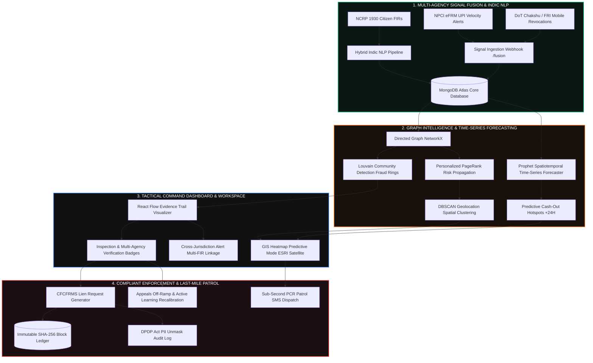

<div align="center">

```
  ██████╗██╗   ██╗██████╗ ███████╗██████╗ ███████╗███████╗███╗   ██╗████████╗██╗███╗   ██╗███████╗██╗     
 ██╔════╝╚██╗ ██╔╝██╔══██╗██╔════╝██╔══██╗██╔════╝██╔════╝████╗  ██║╚══██╔══╝██║████╗  ██║██╔════╝██║     
 ██║      ╚████╔╝ ██████╔╝█████╗  ██████╔╝███████╗█████╗  ██╔██╗ ██║   ██║   ██║██╔██╗ ██║█████╗  ██║     
 ██║       ╚██╔╝  ██╔══██╗██╔══╝  ██╔══██╗╚════██║██╔══╝  ██║╚██╗██║   ██║   ██║██║╚██╗██║██╔══╝  ██║     
 ╚██████╗   ██║   ██████╔╝███████╗██║  ██║███████║███████╗██║ ╚████║   ██║   ██║██║ ╚████║███████╗███████╗
  ╚═════╝   ╚═╝   ╚═════╝ ╚══════╝╚═╝  ╚═╝╚══════╝╚══════╝╚═╝  ╚═══╝   ╚═╝   ╚═╝╚═╝  ╚═══╝╚══════╝╚══════╝
```

### ⚡ Spatiotemporal Cash-Out Forecasting, Multi-Agency Signal Fusion & Field Interdiction ⚡

[](https://fastapi.tiangolo.com)
[](https://react.dev/)
[](https://www.mongodb.com/)
[](https://facebook.github.io/prophet/)
[](https://networkx.org/)
[](https://spacy.io/)
[](https://scikit-learn.org/)
[](https://vitejs.dev/)
[](https://www.typescriptlang.org/)
[](LICENSE)

<p align="center">
  <b>Preemptively forecasting ATM cash-out hotspots, fusing national threat signals (NPCI eFRM & DoT Chakshu), and orchestrating sub-second field patrol interdictions before illicit funds evaporate.</b>
</p>

---

[🚀 Quickstart](#-quickstart--installation) •
[🏛 Architecture](#-system-architecture) •
[🔮 Spatiotemporal Forecasting](#-1-spatiotemporal-cash-out-forecasting-engine) •
[📡 Multi-Agency Fusion](#-2-national-multi-agency-signal-fusion-npci-efrm--dot-chakshu) •
[🕸️ Graph & Syndicate Louvain](#-3-graph-intelligence--louvain-syndicate-detection) •
[📝 Hybrid Indic NLP](#-4-hybrid-nlp-pipeline-for-code-mixed-indic-complaints) •
[🔒 CFCFRMS Lien & Ledger](#-5-cfcfrms-lien-marking--immutable-cryptographic-ledger) •
[🔁 Active Learning Loop](#-6-ml-active-learning-feedback-loop) •
[🌐 Cross-Case Multi-FIR](#-7-cross-case-linking--multi-fir-national-coordination) •
[⚡ Sub-Second Patrol Dispatch](#-8-sub-second-field-patrol-dispatch-alerts) •
[📡 API Reference](#-api-reference)

---

</div>

## 🛡️ Executive Overview

Modern financial cyber fraud moves in minutes, not days. Criminal syndicates deploy layered mule accounts across multiple states and perform coordinated cash withdrawals at ATM terminals within a 15–45 minute operational window.

Traditional approaches are purely **reactive**—they audit transactions days after cash has already left the machine. **CyberSentinel solves the exact problem statement by converting reactive detection into proactive, forward-looking forecasting and last-mile interdiction:**

1. **🔮 Spatiotemporal Cash-Out Forecasting (Next 6h / 12h / 24h)**: Uses **Facebook Prophet** and harmonic seasonal decomposition to predict high-probability cash-out corridors based on diurnal cycles, payday timing, and weekend volatility.
2. **📡 National Multi-Agency Signal Fusion**: Operates as a central intelligence consumer ingesting real-time threat signals from **NPCI eFRM** (UPI velocity), **DoT Chakshu / FRI** (SIM churn & MNRL revocation lists), and **NCRP 1930** helpline feeds.
3. **🕸️ Louvain Syndicate & Graph Intelligence**: Applies **Louvain Community Detection** to uncover dense fraud rings sharing devices or KYC credentials, combined with **Personalized PageRank (PPR)** to trace topological money trails.
4. **📝 Hybrid Code-Mixed Indic NLP**: Normalizes tricky Indic code-mixed text (e.g. `98765-four-3210`, *khata number*, *paise*) using fast regex and **spaCy contextual NER**.
5. **🔒 CFCFRMS Lien-Marking & Immutable Ledger**: Formats banking-ecosystem compliant JSON payloads with officer PIN authorization, SHA-256 block hashing, and **DPDP Act privacy audit-gated unmasking**.
6. **🔁 Active Learning Feedback Loop**: When investigators confirm or dismiss flagged accounts, the system recalibrates Isolation Forest contamination ($C_{\text{new}}$) and PageRank damping ($\alpha$).
7. **🌐 Cross-Case & Multi-FIR Linkage**: Surfaces inter-state syndicate links connecting FIRs across Delhi, Mumbai, Bengaluru, and Hyderabad.
8. **⚡ Sub-Second Field Patrol Alerting**: Calculates Haversine proximity to dispatch encrypted interdiction alerts directly to on-duty PCR patrol vans within a 3 km radius (ETA < 4 mins).

---

## 🏛 System Architecture



---

## 🎯 Complete Capabilities Catalog

### 🔮 1. Spatiotemporal Cash-Out Forecasting Engine
- **Closing the Forecasting Gap**: Foresees future ATM cash-out surges before withdrawals occur.
- **Prophet & Harmonic Seasonal Model**: Evaluates:
  - **Diurnal Waves**: Evening peak withdrawal surges (18:00–22:00 IST).
  - **Weekend Multipliers**: Weekend cash-out surges ($\times 1.45$).
  - **Payday Anomalies**: 1st–5th and 28th–31st salary disbursement surges ($\times 1.6$).
  - **Indian Holidays & Festivals**: Calendar anomaly adjustments for seasonal shopping and fraud spikes.
- **GIS Heatmap "Predictive Mode"**: Toggle between live reactive nodes and forward-looking glowing polygons over forecasted high-risk zones (+6h, +12h, +24h horizons).

$$\hat{y}(t) = g(t) + s_{\text{daily}}(t) + s_{\text{weekly}}(t) + h_{\text{payday}}(t) + \varepsilon_t$$

---

### 📡 2. National Multi-Agency Signal Fusion (NPCI eFRM & DoT Chakshu)
- **Central Intelligence Hub**: Ingests automated webhooks from national bodies:
  - **NPCI eFRM**: Real-time UPI velocity alerts apply a $1.5\times$ amplifier on graph risk scores.
  - **DoT Chakshu / FRI**: Flags Mobile Number Revocation List (MNRL) listings, SIM swaps, and IMEI churn.
  - **NCRP 1930 Helpline**: Cross-verifies formal FIR complaints.
- **Government Verification Badges**: In the entity inspection drawer:
  - 🛡️ `NPCI eFRM Flagged | UPI Velocity Anomaly`
  - 📱 `DoT Chakshu Blocklist | MNRL / SIM Churn`
  - 🏛️ `NCRP 1930 Ingested | FIR Corroborated`

---

### 🕸️ 3. Graph Intelligence & Louvain Syndicate Detection
- **Louvain Modularity Algorithm**: Detects dense fraud rings sharing `SHARED_DEVICE`, `SHARED_KYC`, or `SHARED_PAN` edges to uncover complex fan-out / fan-in money laundering topologies.
- **Personalized PageRank (PPR)**: Propagates risk scores from victim seeds down layering tiers to terminal cash-out nodes while pruning hub nodes (degree > 50) to prevent risk diffusion leaks.
- **Dynamic Evidence Trail Highlighting**: Animates the shortest topological path in glowing red (`#ef4444`) with automatic entity dimming.

---

### 📝 4. Hybrid NLP Pipeline for Code-Mixed Indic Complaints
- **Stage 1 (Fast Regex)**: High-precision extraction of standard UPIs, 10-digit Indian phones (+91), and 9–18 digit bank accounts.
- **Stage 2 (Code-Mixed Indic Normalization)**: Converts disguised word-digits (e.g. `98765-four-3210`, `paanch`, `shunya`) into standard numeric sequences.
- **Stage 3 (Contextual NER Fallback)**: Uses spaCy to extract suspect person names and discovers disguised account numbers surrounded by Indic context keywords (*khata*, *a/c*, *paise*, *transferred*).

---

### 🔒 5. CFCFRMS Lien-Marking & Immutable Cryptographic Ledger
- **CFCFRMS Banking Payload**: Formats standard JSON payloads for bank nodal officers:
  ```json
  {
    "request_id": "LIEN-2026-0908-4412",
    "complaint_id": "NCRP-394811",
    "target_entity": {
      "account_number": "31948571029",
      "ifsc_code": "SBIN0001234",
      "bank_name": "State Bank of India"
    },
    "lien_amount_inr": 45000.00,
    "nodal_officer": {
      "officer_id": "OFFICER_409",
      "digital_signature_hash": "SIG_RSA2048_a9f8b7..."
    },
    "evidence_confidence_score": 94.2
  }
  ```
- **Cryptographic Receipt Viewer**: Chained with SHA-256 hashes over previous block hashes ($H_n = \text{SHA-256}(H_{n-1} + \text{JSON}_{\text{canonical}})$).
- **DPDP Act Privacy Compliance**: Masked PII (`3194****1029`, `******3210`) with statutory audit-gated unmasking before revealing raw data.

---

### 🔁 6. ML Active Learning Feedback Loop
- **Dynamic Recalibration on Investigator Decisions**: When an investigator unfreezes a false positive account or confirms a mule:
  $$C_{\text{new}} = \max\left(0.01, \min\left(0.20, C_{\text{old}} \times (1 - \text{FPR}) + \text{penalty}\right)\right)$$
  $$\alpha_{\text{new}} = \max\left(0.60, \min\left(0.98, \alpha_{\text{old}} + (\text{FPR} \times 0.08)\right)\right)$$
- Protects innocent merchants from over-aggressive anomaly flagging.

---

### 🌐 7. Cross-Case Linking & Multi-FIR National Coordination
- **Inter-State Syndicate Linkage**: Identifies when a mule account, device, or phone is implicated in multiple state police FIRs (e.g. Delhi, Mumbai, Vijayawada).
- **Cross-Jurisdiction Alert**: Surfaces an alert banner in the entity drawer and marks graph nodes with `🚨 MULTI-FIR LINK | 3 Cases`.

---

### ⚡ 8. Sub-Second Field Patrol Dispatch Alerts
- **Haversine Geolocation Routing**: Calculates great-circle distance from the flagged ATM terminal to locate the closest on-duty PCR patrol van within 3 km.
- **Sub-Second Dispatch Payload**: Transmits SMS/Sandes encrypted payloads with exact ATM coordinates, forecasted cash-out time window, and ETA (< 4 mins).

---

## 💻 Tech Stack Architecture

| Layer | Technologies |
|---|---|
| **Backend API** | **FastAPI**, **Python 3.11+**, **Uvicorn**, **Pydantic v2** |
| **Database & Ledger** | **MongoDB Atlas**, **Motor (Async I/O)**, **SHA-256 Blockchain Hash** |
| **Forecasting & ML** | **Facebook Prophet**, **Scikit-Learn (Isolation Forest, DBSCAN)**, **NumPy**, **Pandas** |
| **Graph Intelligence** | **NetworkX**, **Louvain Modularity (`python-louvain`)**, **Personalized PageRank** |
| **NLP & Extraction** | **spaCy (`en_core_web_md`)**, **Indic Regex Normalizer** |
| **Frontend Framework** | **React 19**, **TypeScript 5.x**, **Vite 8** |
| **Graph Visualization** | **@xyflow/react (React Flow v12)**, **Dagre Auto-Layout** |
| **Spatial GIS Mapping** | **Leaflet**, **React-Leaflet**, **ESRI World Imagery Satellite Tiles** |
| **Styling & Icons** | **TailwindCSS 4**, **Lucide Icons**, **Custom Dark SOC Theme** |
| **Testing & Quality** | **PyTest**, **Jest**, **React Testing Library** |

---

## 🚀 Quickstart & Installation

### Prerequisites
- **Node.js** $\ge$ 18.x (Recommended: Node 20 LTS)
- **Python** $\ge$ 3.10 (Recommended: Python 3.11)
- **MongoDB** $\ge$ 6.0 (Local daemon running on `localhost:27017` or MongoDB Atlas URI)

---

### Step 1: Clone Repository
```bash
git clone https://github.com/malikafarah/CyberSentinel.git
cd CyberSentinel
```

---

### Step 2: Backend Setup & Seed Database
```bash
cd backend

# Create & activate virtual environment
python -m venv venv
# On Windows (PowerShell):
.\venv\Scripts\Activate.ps1
# On Linux/macOS:
source venv/bin/activate

# Install dependencies
pip install -r requirements.txt

# Download spaCy model (optional, heuristic fallback included)
python -m spacy download en_core_web_md

# Seed database with baseline cases, nodes, and locations
python app/seed_db.py

# Start FastAPI server
uvicorn app.main:app --reload --host 0.0.0.0 --port 8000
```
> Interactive OpenAPI documentation available at: **`http://localhost:8000/docs`**

---

### Step 3: Frontend Setup
```bash
cd ../frontend

# Install dependencies
npm install

# Start Vite live development server
npm run dev
```
> Access the CyberSentinel Tactical Dashboard at: **`http://localhost:5173`**

---

## 📡 Complete API Reference

### 🔮 Time-Series Forecasting (`/api/v1/predictions` & `/api/v1/engine`)
| Method | Endpoint | Description |
|---|---|---|
| `GET` | `/api/v1/predictions/forecast` | Spatiotemporal ATM cashout forecast (+6h, +12h, +24h) |
| `GET` | `/api/v1/engine/forecast` | Engine forecasting alias returning zone bounding boxes |

### 📡 Multi-Agency Signal Fusion (`/api/v1/fusion`)
| Method | Endpoint | Description |
|---|---|---|
| `POST` | `/api/v1/fusion/ingest-signal` | Ingest real-time threat signals from NPCI eFRM & DoT Chakshu |
| `GET` | `/api/v1/fusion/signals` | List chronological multi-agency threat signals |

### 🕸️ Graph Intelligence & Syndicate Detection (`/api/v1/engine`)
| Method | Endpoint | Description |
|---|---|---|
| `GET` | `/api/v1/engine/syndicates` | Execute Louvain Community Detection to group fraud rings |
| `POST` | `/api/v1/engine/propagate-risk` | Trigger Markov Personalized PageRank risk propagation |
| `GET` | `/api/v1/engine/stream-pipeline` | Server-Sent Events (SSE) live intelligence log stream |
| `POST` | `/api/v1/engine/feedback` | Active learning feedback loop to recalibrate hyperparameters |
| `GET` | `/api/v1/engine/hyperparams` | Inspect active Isolation Forest & PageRank parameters |

### 📋 NCRP Intake & NLP (`/api/v1/intake`)
| Method | Endpoint | Description |
|---|---|---|
| `POST` | `/api/v1/intake/extract` | Hybrid Regex + spaCy NER entity extraction from raw text |
| `POST` | `/api/v1/intake/seed-victims` | Seed extracted entities into MongoDB graph with Risk Score 100 |
| `POST` | `/api/v1/intake/complaint` | Full complaint processing and graph auto-seeding |

### 🔒 Actions, CFCFRMS & Field Patrol (`/api/v1/action`)
| Method | Endpoint | Description |
|---|---|---|
| `POST` | `/api/v1/action/lien` | Formulate and sign compliant CFCFRMS Lien Request JSON |
| `POST` | `/api/v1/action/freeze` | Freeze target account with digital signature & PIN authorization |
| `POST` | `/api/v1/action/unfreeze` | Legal appeals off-ramp unfreezing with active learning recalibration |
| `POST` | `/api/v1/action/dispatch-patrol` | Sub-second field patrol SMS alert to nearest PCR van |
| `GET` | `/api/v1/action/audit-logs` | Retrieve immutable SHA-256 blockchain audit logs |

### 🛡️ DPDP Act Privacy (`/api/v1/audit`)
| Method | Endpoint | Description |
|---|---|---|
| `POST` | `/api/v1/audit/log-access` | Log statutory officer justification before unmasking PII |

---

## 🧪 Test Suite & Validation

Run the automated test suite across backend Python ML pipelines and React frontend components:

```bash
# Backend Test Suite (Forecasting, Louvain, Fusion, Active Learning, Dispatch)
cd backend
python -m tests.test_forecasting
python -m tests.test_syndicates
python -m tests.test_nlp_parser
python -m tests.test_fusion
python -m tests.test_feedback
python -m tests.test_dispatch

# Frontend Test Suite & Production Build Verification
cd ../frontend
npm test
npm run build
```

---

## 👥 Authors & Acknowledgments

- Developed by **Malika Farah** and the **CyberSentinel Engineering Team**.
- Built for cybercrime response units, law enforcement analytics, and financial cyber defense teams.

---

## 📜 License

This project is licensed under the **MIT License** — see the [LICENSE](LICENSE) file for details.

<div align="center">
  <sub>CYBERSENTINEL PREDICTIVE INTELLIGENCE PLATFORM • SECURING FINANCIAL ECOSYSTEMS</sub>
</div>
