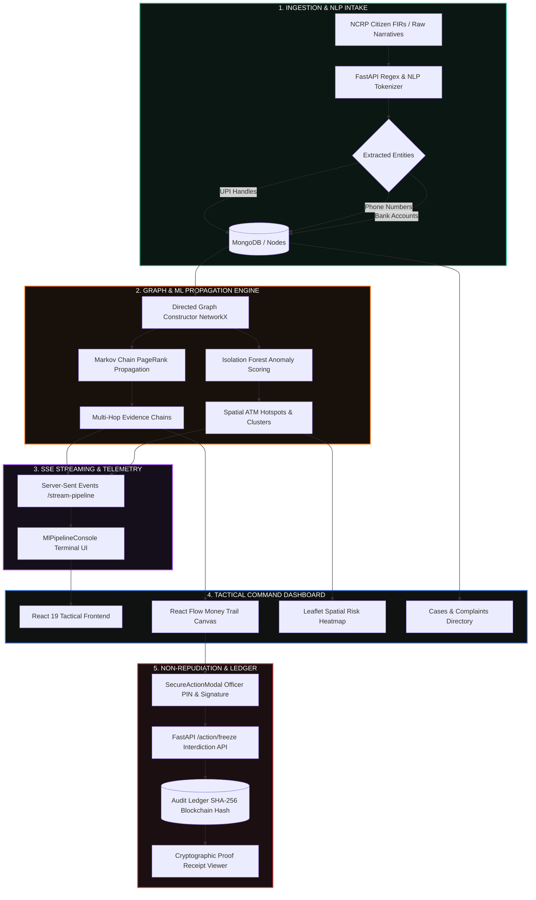

<div align="center">

```
  ██████╗██╗   ██╗██████╗ ███████╗██████╗ ███████╗███████╗███╗   ██╗████████╗██╗███╗   ██╗███████╗██╗     
 ██╔════╝╚██╗ ██╔╝██╔══██╗██╔════╝██╔══██╗██╔════╝██╔════╝████╗  ██║╚══██╔══╝██║████╗  ██║██╔════╝██║     
 ██║      ╚████╔╝ ██████╔╝█████╗  ██████╔╝███████╗█████╗  ██╔██╗ ██║   ██║   ██║██╔██╗ ██║█████╗  ██║     
 ██║       ╚██╔╝  ██╔══██╗██╔══╝  ██╔══██╗╚════██║██╔══╝  ██║╚██╗██║   ██║   ██║██║╚██╗██║██╔══╝  ██║     
 ╚██████╗   ██║   ██████╔╝███████╗██║  ██║███████║███████╗██║ ╚████║   ██║   ██║██║ ╚████║███████╗███████╗
  ╚═════╝   ╚═╝   ╚═════╝ ╚══════╝╚═╝  ╚═╝╚══════╝╚══════╝╚═╝  ╚═══╝   ╚═╝   ╚═╝╚═╝  ╚═══╝╚══════╝╚══════╝
```

### ⚡ Autonomous Financial Cybercrime Interdiction & Predictive Intelligence System ⚡

[](https://fastapi.tiangolo.com)
[](https://react.dev/)
[](https://www.mongodb.com/)
[](https://networkx.org/)
[](https://scikit-learn.org/)
[](https://vitejs.dev/)
[](https://www.typescriptlang.org/)
[](LICENSE)

<p align="center">
  <b>Transforming unstructured cybercrime narratives into real-time graph intelligence, predictive spatial heatmaps, and cryptographically verified interdiction actions.</b>
</p>

---

[🚀 Quickstart](#-quickstart--installation) •
[🏛 Architecture](#-system-architecture) •
[🧠 Intelligence Engine](#-graph--ml-intelligence-engine) •
[🎯 Core Capabilities](#-core-capabilities) •
[🔐 Cryptographic Non-Repudiation](#-digital-signature-authorization--ledger) •
[📡 API Reference](#-api-reference) •
[🧪 Test Suite](#-test-suite--validation)

---

</div>

## 🛡️ Executive Overview

**CyberSentinel** is an enterprise-grade tactical command platform engineered for law enforcement agencies, cyber fraud intelligence units, and financial intelligence investigators. 

Modern cyber fraudsters exploit rapid multi-layered mule networks, transient UPI IDs, and geographical cashout clusters to siphon illicit funds before traditional batch-audit mechanisms can react. **CyberSentinel collapses detection and interdiction time from days to seconds** through:

1. **Natural Language Complaint Ingestion (NCRP)**: Instantly parses unstructured citizen FIRs and complaints to extract victim roots, scammer handles, phone numbers, and beneficiary bank accounts.
2. **Directed Graph Risk Propagation**: Builds topological dependency graphs using **NetworkX** and **PageRank algorithms** to trace multi-hop money laundering trails.
3. **GIS Spatial Threat Prediction**: Projects physical ATM cashout clusters and predictive crime corridors using **Haversine dispersion models** and **Isolation Forests**.
4. **Interactive Graph Workspace**: Real-time **React Flow** interactive canvas highlighting shortest-path evidence chains with flowing visual animations.
5. **Cryptographic Non-Repudiation Interdiction**: Enforces digital signature verification and officer PIN authorization before executing automated API freezes, committing deterministic SHA-256 block receipts to an immutable ledger stream.

---

## 🏛 System Architecture



---

## 🎯 Core Capabilities

### 1. 📋 Unstructured NCRP Complaint Intake & NLP Entity Parsing
- **Zero-Friction Intake**: Officers paste raw citizen statements or FIR text directly into the console.
- **NLP Extraction**: Custom regex and heuristic tokenizers automatically isolate Indian phone numbers (`+91` format), VPA/UPI handles (`user@bank`), and 9–18 digit account numbers.
- **One-Click Graph Seeding**: Seeds parsed identifiers as root `VICTIM` nodes with **Risk Score 100** directly into the graph engine.

### 2. 🌐 Interactive React Flow Money Trail Workspace
- **Topological Evidence Trail Visualizer**: Click any mule node or terminal ATM to dynamically compute and highlight the shortest topological path from the initial victim root.
- **Flowing Animated Edges**: Renders animated glowing red strokes (`#ef4444`, `strokeWidth: 3.5`) down the exact pipeline of illicit transactions.
- **Automatic Entity Dimming**: Non-participating nodes and irrelevant edges are dimmed (`opacity: 0.25`) to eliminate visual noise during critical triage.
- **Dedicated Evidence Steps Panel**: Chronologically displays sequential steps:
  $$\text{Victim (Origin)} \longrightarrow \text{Mule Account (Layering)} \longrightarrow \text{ATM Terminal (Cash-out)}$$

### 3. 🗺️ Predictive GIS Spatial Risk Heatmap
- **Hotspot Clustering**: Plots physical coordinates of ATM terminals, banking kiosks, and transaction nodes across monitored jurisdictions.
- **Dynamic Risk Categorization**: Nodes are classified into **CRITICAL** ($\ge 80\%$), **HIGH** ($50-79\%$), **MEDIUM** ($30-49\%$), and **LOW** ($< 30\%$) risk tiers.
- **Tactical Dark Map Tiles**: CartoDB dark matter basemaps with pulsing radial glow rings surrounding high-probability cashout points.

### 4. 🔐 Digital Signature Authorization & Cryptographic Receipt Modal
- **Non-Repudiation Security**: Freezing an account requires explicit **Officer PIN authentication** and structured **Justification Reasons**.
- **SHA-256 Ledger Linking**: Action hashes are chained to previous block hashes ($H_n = \text{SHA-256}(H_{n-1} + \text{JSON}_{\text{canonical}})$) ensuring immutable chain-of-custody.
- **In-Place Cryptographic Receipt Viewer**: Transforms upon submission to display Transaction IDs, deterministic JSON payloads, and verified timestamps with one-click clipboard copying.

### 5. ⚡ Real-Time Server-Sent Events (SSE) ML Console
- **Live Streamed ML Logs**: Connects to `GET /api/v1/engine/stream-pipeline` via standard browser `EventSource`.
- **Live Terminal Telemetry**: Color-coded line-by-line streaming of NetworkX graph construction, PageRank iterations, and anomaly detection.
- **Full Operational Controls**: Execute, abort, copy, and clear terminal telemetry streams directly from the dashboard.

### 6. 📁 Dynamic Case Directory & Lifecycle Management
- **Centralized Case Management**: Replaces hardcoded case logic with a dynamic case repository supporting filtering by severity and status (`ACTIVE`, `IN_PROGRESS`, `PENDING`, `CLOSED`).
- **Inline Status Toggling**: Officers can update case statuses in-place via `PATCH /api/v1/cases/{id}`.
- **Modal Creation**: Create customized cases with pre-populated threat summaries and automated routing to interactive graph workspaces.

---

## 🧠 Graph & ML Intelligence Engine

### Mathematical Formulations

#### 1. Markov Chain PageRank Risk Dispersion
Risk propagation through the financial transaction network is computed via a modified directed PageRank formulation with non-uniform personalization vectors seeded by validated victim nodes:

$$\mathbf{R}^{(t+1)} = d \cdot \mathbf{M} \mathbf{R}^{(t)} + (1 - d) \cdot \mathbf{v}_{\text{seed}}$$

Where:
- $\mathbf{R}$ is the vector of node risk scores.
- $d = 0.85$ is the damping factor.
- $\mathbf{M}$ is the row-normalized adjacency transition matrix: $M_{ij} = \frac{w_{ij}}{\sum_{k} w_{ik}}$.
- $\mathbf{v}_{\text{seed}}$ is the personalization vector concentrated on verified victim/mule nodes ($\text{score} = 1.0$).

#### 2. Spatial Dispersion Decay Model (Haversine Distance)
Spatial risk correlation between transaction accounts and physical ATM cash-out points decays inversely with geographic distance:

$$S_{\text{risk}}(A_i, L_j) = R(A_i) \cdot \exp\left( -\frac{\mathcal{H}(A_i, L_j)^2}{2\sigma^2} \right)$$

$$\mathcal{H}(\phi_1, \lambda_1, \phi_2, \lambda_2) = 2R_{\text{earth}} \arcsin\left(\sqrt{\sin^2\left(\frac{\Delta\phi}{2}\right) + \cos\phi_1\cos\phi_2\sin^2\left(\frac{\Delta\lambda}{2}\right)}\right)$$

#### 3. Deterministic Ledger Block Hashing
Every interdiction action is cryptographically sealed using SHA-256 over canonicalized JSON strings:

$$H_{\text{current}} = \text{SHA-256}\Big( H_{\text{previous}} \;\big\|\; \text{CanonicalJSON}\big( \text{action}, \text{officer\_id}, \text{target}, \text{sig}, \text{timestamp} \big) \Big)$$

---

## 💻 Tech Stack

| Layer | Technologies |
|---|---|
| **Backend Core** | **FastAPI**, **Python 3.11+**, **Uvicorn**, **Pydantic v2** |
| **Database & Persistence** | **MongoDB Atlas / Local**, **Motor (Async I/O)**, **PyMongo** |
| **Graph & ML Engine** | **NetworkX**, **Scikit-Learn**, **NumPy**, **Pandas** |
| **Frontend Framework** | **React 19**, **TypeScript 5.x**, **Vite 8** |
| **Graph Visualization** | **@xyflow/react (React Flow v12)**, **Dagre Graph Layout** |
| **Spatial Mapping** | **Leaflet**, **React-Leaflet**, **CartoDB Dark Matter Tiles** |
| **Charts & Analytics** | **Recharts (Donut, Line, Area Metrics)** |
| **Styling & Aesthetics** | **Vanilla CSS Design Tokens**, **TailwindCSS 4**, **Lucide Icons** |
| **Testing & Quality** | **React Testing Library**, **Jest / Vitest**, **JSDOM Mocks** |

---

## 🚀 Quickstart & Installation

### Prerequisites
- **Node.js** $\ge$ 18.x (Recommended: Node 20 LTS)
- **Python** $\ge$ 3.10 (Recommended: Python 3.11)
- **MongoDB** $\ge$ 6.0 (Local daemon running on `localhost:27017` or MongoDB Atlas URI)

---

### Step 1: Clone the Repository
```bash
git clone https://github.com/malikafarah/CyberSentinel.git
cd CyberSentinel
```

---

### Step 2: Backend Setup & Seed Database

```bash
cd backend

# Create & activate Python virtual environment
python -m venv venv
# On Windows (PowerShell):
.\venv\Scripts\Activate.ps1
# On Linux/macOS:
source venv/bin/activate

# Install dependencies
pip install -r requirements.txt

# (Optional) Seed the MongoDB database with initial sample nodes, cases, and alerts
python app/seed_db.py

# Start FastAPI development server
uvicorn app.main:app --reload --host 0.0.0.0 --port 8000
```
> The backend API documentation will be interactively available at: **`http://localhost:8000/docs`**

---

### Step 3: Frontend Setup

```bash
cd ../frontend

# Install npm dependencies
npm install

# Start Vite live development server
npm run dev
```
> Access the CyberSentinel Tactical Dashboard at: **`http://localhost:5173`**

---

### 🐳 Docker Compose (One-Click Launch)

To spin up the full stack (FastAPI Backend + MongoDB + React Frontend):

```bash
docker-compose up --build
```

---

## 📡 API Reference

### 🔐 Authentication (`/api/v1/auth`)
| Method | Endpoint | Description |
|---|---|---|
| `POST` | `/api/v1/auth/login` | Authenticate officer and retrieve JWT bearer token |
| `GET` | `/api/v1/auth/me` | Fetch authoritative user profile and RBAC role |

### 📋 NCRP Intake & NLP (`/api/v1/intake`)
| Method | Endpoint | Description |
|---|---|---|
| `POST` | `/api/v1/intake/extract` | Non-mutating NLP extraction of UPIs, phones, and bank accounts |
| `POST` | `/api/v1/intake/seed-victims` | Seed extracted victim nodes into MongoDB with Risk Score 100 |
| `POST` | `/api/v1/intake/complaint` | Full pipeline complaint logging and node seeding |

### 🕸️ Graph Intelligence & Engine (`/api/v1/engine`)
| Method | Endpoint | Description |
|---|---|---|
| `GET` | `/api/v1/engine/case/{case_id}` | Generate React Flow nodes and edges for specified case |
| `GET` | `/api/v1/engine/stream-pipeline` | Server-Sent Events (SSE) live pipeline log stream |
| `POST` | `/api/v1/engine/propagate-risk` | Trigger NetworkX Markov PageRank risk propagation |

### 🚨 Actions & Cryptographic Ledger (`/api/v1/action`)
| Method | Endpoint | Description |
|---|---|---|
| `POST` | `/api/v1/action/freeze` | Authorize account freeze with PIN & digital signature (returns SHA-256 block receipt) |
| `POST` | `/api/v1/action/unfreeze` | Revert interdiction status with audit logging |
| `GET` | `/api/v1/action/audit-logs` | Retrieve chronological cryptographic ledger stream |

### 📁 Case Management (`/api/v1/cases`)
| Method | Endpoint | Description |
|---|---|---|
| `GET` | `/api/v1/cases/` | List all investigation cases |
| `POST` | `/api/v1/cases/` | Create a new investigation case |
| `GET` | `/api/v1/cases/{case_id}` | Retrieve specific case details and timeline |
| `PATCH` | `/api/v1/cases/{case_id}` | Update case status, summary, or risk level |
| `POST` | `/api/v1/cases/{case_id}/notes` | Append investigative notes |

---

## 🧪 Test Suite & Validation

CyberSentinel includes unit and integration tests across graph visualizers, SSE streaming consoles, and security modals.

```bash
cd frontend

# Run test suite
npm test

# Run TypeScript compilation & production build verification
npm run build
```

### Key Test Suites:
- **`setupTests.ts`**: Global DOM API mocks (`ResizeObserver`, `DOMMatrix`, `scrollIntoView`) for headless environments.
- **`InvestigationWorkspace.test.tsx`**: Integration test verifying React Flow evidence chain highlighting (`border: 2px solid #ef4444`), edge animations, and node dimming (`opacity: 0.3`).
- **`SecureActionModal.test.tsx`**: Tests authorization PIN verification, error states, and transition to cryptographic SHA-256 receipt view.
- **`MlPipelineConsole.test.tsx`**: Mocks browser `EventSource` to validate live SSE streaming, message receipt, and automatic stream closure on `[SUCCESS]`.

---

## 🎨 Tactical UI Aesthetic & Design Tokens

CyberSentinel utilizes a custom dark tactical color palette designed for high-stress security operations centers (SOC):

```css
:root {
  --bg-primary: #0F1210;         /* Deep tactical Obsidian */
  --surface: #121714;            /* Raised panel slate */
  --surface-muted: #1A211D;      /* Input & card background */
  --accent: #48D878;             /* Telemetry green */
  --accent-critical: #EF4444;    /* Critical threat red */
  --accent-warning: #F97316;     /* Mule layering orange */
  --accent-info: #3B82F6;        /* Frozen interdiction blue */
  --border: rgba(255, 255, 255, 0.08);
  --border-strong: rgba(255, 255, 255, 0.16);
  --font-mono: "JetBrains Mono", monospace;
}
```

---

## 👥 Authors & Acknowledgments

- Developed by **Malika Farah** and the **CyberSentinel Engineering Team**.
- Built for cybercrime response units, law enforcement analytics, and financial cyber defense teams.

---

## 📜 License

This project is licensed under the **MIT License** — see the [LICENSE](LICENSE) file for details.

<div align="center">
  <sub>CYBERSENTINEL PREDICTIVE INTELLIGENCE PLATFORM • SECURING FINANCIAL ECOSYSTEMS</sub>
</div>
